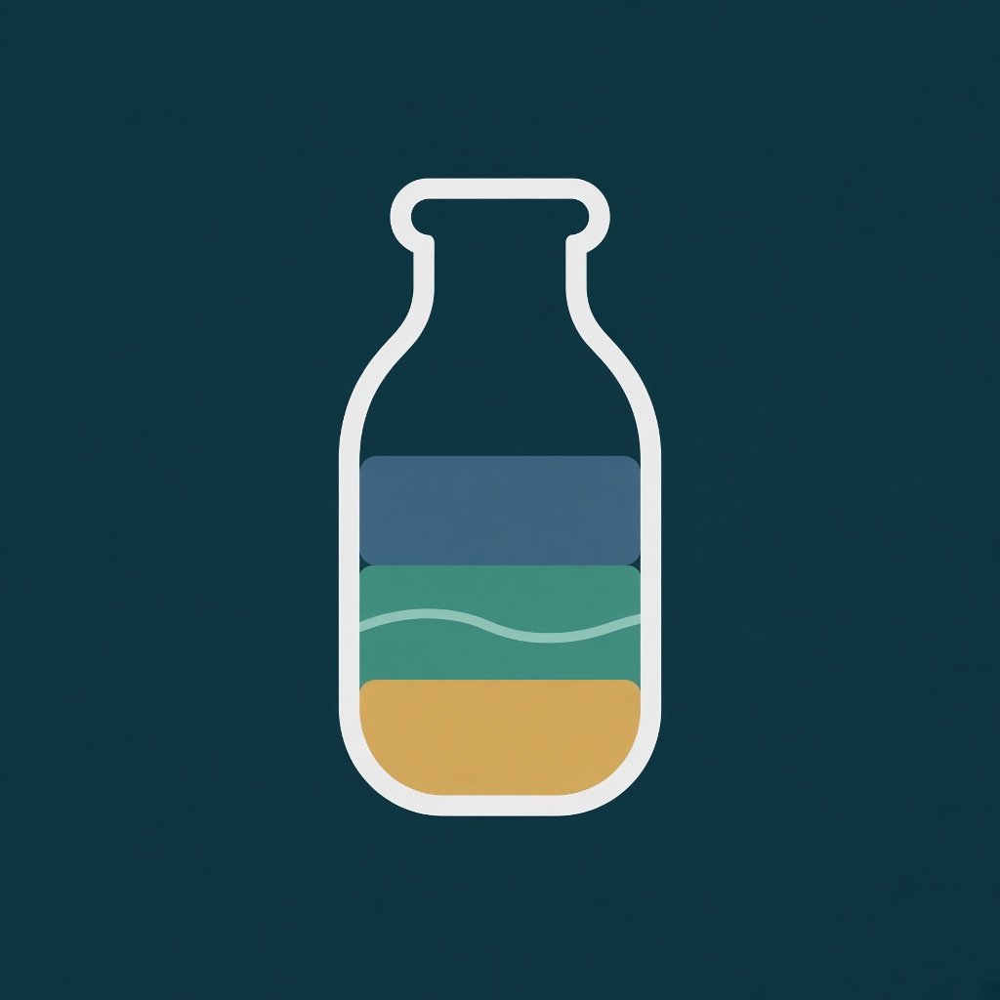

# Stillvial

<p align="center">
  
</p>

**A calm Water Sort–style puzzle** — offline, ad-free, privacy-first — designed **first** for players who need low-pressure, predictable, sensory-friendly play (including many people with **ADHD** or on the **autism** spectrum). Everyone is welcome; when we choose between flashy and calm, we choose calm.

Built with **Godot 4** for Android + Web.

**Repository:** [github.com/waldopanozo/Stillvial](https://github.com/waldopanozo/Stillvial)

Stillvial is a game and accessibility-minded hobby product — **not** medical advice or therapy.

## Why it feels different

- **Zen by default** — no timers, energy, or pressure loops  
- **Patterns + color** — sort with shapes as well as hues  
- **Sensory controls** — soft/optional sound & haptics; low-effects mode  
- **Predictable** — deterministic levels, undo, reset, local resume  
- **No ads, no tracking** — your attention stays on the tubes  
- **Guest-first** — play with zero account; optional cloud backup / sign-in later (never required)

## Docs

- [Brand decision](./docs/market-research/04-decision.md)
- [Design spec](./docs/design/stillvial-design.md)
- Market research: `docs/market-research/`
- Implementation plan: [docs/plans/2026-09-04-stillvial-mvp-godot.md](./docs/plans/2026-09-04-stillvial-mvp-godot.md)
- Icon draft: [docs/market-research/assets/stillvial-icon-vial-at-rest.png](./docs/market-research/assets/stillvial-icon-vial-at-rest.png)

## Status

Godot MVP plan complete (Tasks 1–10): playable campaign, save/resume, tips, patterns, daily, export presets. Install Godot export templates before producing APK/Web binaries. Next design track: guest-first optional sync (§8) — start with local export/import, then opt-in cloud.

## Development

- Engine: **Godot 4.7.x** (project features `4.7`)
- Open `game/project.godot` in Godot, or:

```bash
cd game && godot --path . --editor
```

## Export

Presets live in [`game/export_presets.cfg`](./game/export_presets.cfg). Artifacts go under `export/` (gitignored build output).

| Preset | Platform | Output | Package / notes |
|--------|----------|--------|-----------------|
| `Android` | Android APK | `export/android/stillvial.apk` | `com.waldopanozo.stillvial`; arm64-v8a + armeabi-v7a; no Internet permission |
| `Web` | HTML5 | `export/web/index.html` | Threads **off** (easier static hosting; no COOP/COEP required) |

Offline, no-ads builds: keep Android permissions at defaults (all off) unless you intentionally add optional haptics later.

### 1. Install export templates

Templates are **not** bundled with the editor binary. For Godot **4.7.2**:

1. Editor → **Manage Export Templates** → download/install matching version, **or**
2. Manual: get `Godot_v4.7.2-stable_export_templates.tpz` from [godotengine.org/download](https://godotengine.org/download/archive/), then extract into:

```text
~/.local/share/godot/export_templates/4.7.2.stable/
```

You should see files such as `web_nothreads_debug.zip` / `android_debug.apk` there.

Android also needs the Android SDK + JDK configured under **Editor → Editor Settings → Export → Android** (this machine already points at a debug keystore under `~/.local/share/godot/keystores/`).

### 2. Export from the editor

1. Open the `game/` project.
2. **Project → Export…**
3. Select **Android** or **Web** → **Export Project…** (or Export All).

### 3. Export from the CLI

```bash
mkdir -p export/android export/web
cd game

# Debug (local / device testing)
godot --headless --path . --export-debug "Web" ../export/web/index.html
godot --headless --path . --export-debug "Android" ../export/android/stillvial.apk

# Release (after templates + signing are ready)
godot --headless --path . --export-release "Web" ../export/web/index.html
godot --headless --path . --export-release "Android" ../export/android/stillvial.apk
```

Serve the web build with any static server, e.g. `python3 -m http.server -d ../export/web 8080`.

### Android signing (no secrets in git)

- **Debug / local:** leave keystore fields empty in the preset. Godot uses the Editor debug keystore (`debug.keystore`, user `android`, password `android` — the platform default). Do **not** commit keystore passwords or release keys.
- **Release / Play:** create your own upload keystore locally; set path + user in the Editor export dialog or via env vars (`GODOT_ANDROID_KEYSTORE_RELEASE_*`). Keep passwords out of `export_presets.cfg` and the repo.

### Smoke check (this environment)

Export templates were **not** installed under `~/.local/share/godot/export_templates/` when presets were added. A CLI Web export correctly failed with missing `web_nothreads_debug.zip` / `web_nothreads_release.zip`. After installing templates for **4.7.2.stable**, re-run the Web command above to verify.